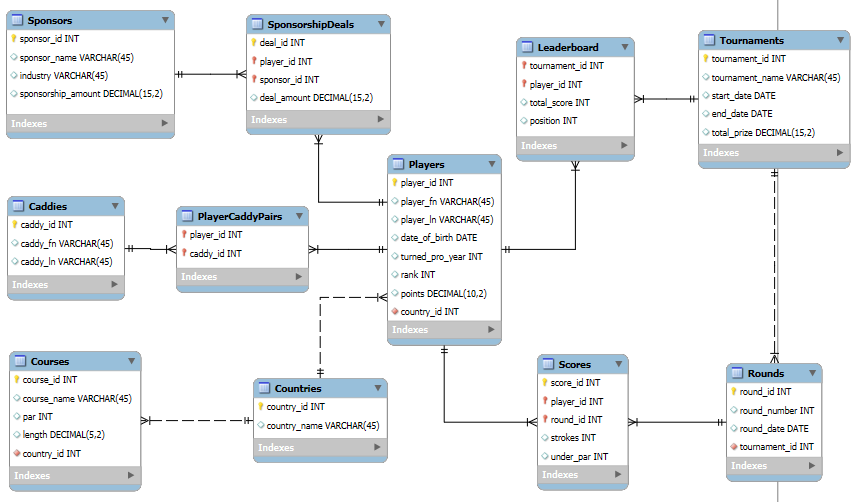

# MIST4610GroupProject1

## Team Name and Members
**group8**
- Forcucci, Enzo @En90
- Runckel, David
- Tesfai, Ben
- Trotman, William
  
## Scenario Description
Tasked with constructing a data model, populating its corresponding database, and formulating relevant SQL queries, my fellow group members and I landed on using the PGA Tour as the basis of our group project. [description of the PGA Tour] 

## Data Model

The PGA Tour data model contains 11 total entities, 4 of those being created from the many-to-many relationships between entities. Below will be descriptions of each entity in order of importance regarding their value and number of relationships.

**1.** Players: The Players entity is the core entity within the PGA Tour data model with 5 individual relationships. It serves to represent each individual player associated and recorded in the PGA Tour. It contains the player's unique ID, first name, last name, date of birth, year they turned pro, rank, points, and country of each player recorded in the database. The country of each player is integrated into the Players entity through the one-to-many relationship between Countries and Players. This relationship is further explained in the Countries entity. Two attributes that may require further clarification are rank and points. Rank is simply what each player's current or last recorded rank is among their peers while points are a score-based system recorded by the official PGA for each player, allocated based on individual performance within tournaments that the player participated in.

**2.** Tournaments: The PGA Tour orchestrates multiple tournaments for professional golfers to compete in. The Tournaments entity is another primary entity within the PGA Tour data model. It stores data revolving around each tournament played tied to the PGA Tour. It has a many-to-many relationship with Players in the form of the Leaderboard entity.

**3.** Leaderboard: The Leaderboard entity stores data on the players' performance in each individual tournament. It holds their score at the end of the tournament along with their finishing position within. The leaderboard doesn't store the player's overall position in the PGA Tour, just their ending position in that singular tournament.

**4.** Rounds: The Rounds entity stores individual round data from each tournament. There are many rounds in a tournament. This is why the Rounds entity is on the "many" end of the one-to-many relationship with Tournaments. It stores the round number and the day the round was on.

**5.** Scores: Each player receives a score after each round in a tournament based on their performance. It is the resultant entity from the many-to-many relationship between Players and Rounds. The Scores entity stores the player ID and round ID so it can tie the scores in that round to each correct player.

**6.** Sponsors: Sponsors are business entities that contribute money to the PGA Tour and individual players. They help the Tour operate and represent the business side of professional golf.

**7.** SponsorshipDeals: Sponsorship Deals are strictly the deals between players and sponsors. Recorded in this entity are the connected player's and sponsor's ID along with the amount of the deal struck between the two parties.

**8.** Caddies: Caddies are the on-course helpers of the players. A player can only have one caddy and caddies can only assist a single player.

**9.** PlayerCaddyPairs The bonding entity between Players and Caddies. It stores the individual IDs of the players and caddies as a composite primary key.

**10.** Countries: The Countries entity has two separate one-to-many relationships with the Players and Courses entities. This is because each country can have many players from there and possess multiple courses within its borders.

**11.** Courses: The Courses entity represents courses used in tournaments held by the PGA Tour. Within is each course's unique ID, name, par score, total length, and country where it resides. The country is integrated by the one-to-many relationship between Countries and Courses. 

## Data Dictionary
**Players Table**

| Column Name | Description | Data Type | Size | Format | Key |
|:------------|:------------|:----------|:-----|:-------|:----|
| player_id | primary key of Players table | INT | | | PK |
| player_fn| first name of player | VARCHAR | 45 | | |
| player_ln | last name of player | VARCHAR | 45 | | |
| date_of_birth| date players were born | DATE | | YYYY/MM/DD | |
| turned_pro_year| date players became pro golfers | DATE | | YYYY/MM/DD | |
| rank | current rank of the player among peers | INT | | | |
| points | current total points from all tournaments player participated in that season | DECIMAL | (10,2) | | |
| country_id | foreign key of Countries table recording where each player is from | INT | | | FK |

**Tournaments Table**
| Column Name | Description | Data Type | Size | Format | Key |
|:------------|:------------|:----------|:-----|:-------|:----|
| tournament_id | primary key of Tournaments Table | INT | | | PK |
| tournament_name | name of tournament | VARCHAR | 45 | | |
| start_date | date the tournament began | DATE | | YYYY/MM/DD | |
| end_date | date the tournament ended | DATE | | YYYY/MM/DD | |
| total_prize | cash reward for the winners of the tournament | DECIMAL | (15,2) | | |

**Leaderboard Table**
| Column Name | Description | Data Type | Size | Format | Key |
|:------------|:------------|:----------|:-----|:-------|:----|
| tournament_id | composite primary key from one-to-many relationship with Tournaments Table | INT | | | PK |
| player_id | composite primary key from one-to-many relationship with Players Table | INT | | | PK |
| total_score | total score the player had during the tournament | INT | | | |
| position | finishing position of the player in the tournament | INT | | | |

**Rounds Table**
| Column Name | Description | Data Type | Size | Format | Key |
|:------------|:------------|:----------|:-----|:-------|:----|
| round_id | primary key of Rounds Table | INT | | | PK |
| round_number | which round it is within the tournament | INT | | | |
| round_date | day the round was held | DATE | | YYYY/MM/DD | |
| tournament_id | foreign key of Tournaments Table recording which tournament the round is part of | INT | | | FK |

**Scores Table**
| Column Name | Description | Data Type | Size | Format | Key |
|:------------|:------------|:----------|:-----|:-------|:----|
| score_id | primary key of Scores Table | INT | | | PK |
| player_id | foreign key from Players Table serving as a composite primary key | INT | | | PK |
| round_id | foreign key from Rounds Table serving as a composite primary key | INT | | | PK |
| strokes | total strokes taken by the player in that round | INT | | | |
| under_par | +/- value of player based on performance on holes in the round | INT | | | |

**Sponsors Table**
| Column Name | Description | Data Type | Size | Format | Key |
|:------------|:------------|:----------|:-----|:-------|:----|
| sponsor_id | primary key of Sponsors Table | INT | | | PK |
| sponsor_name | name of the sponsor | VARCHAR | 45 | | |
| industry | what industry the sponsor belongs to | VARCHAR | 45 | | |

**SponsorshipDeals Table**
| Column Name | Description | Data Type | Size | Format | Key |
|:------------|:------------|:----------|:-----|:-------|:----|
| deal_id | primary key of the SponsorshipDeals Table | INT | | | PK |
| player_id | foreign key from Players Table serving as a composite primary key | INT | | | PK |
| sponsor_id | foreign key from Sponsors Table serving as a composite primary key | INT | | | PK |
| deal_amount | sponsorship amount paid to the player | DECIMAL | (15,2) | | |

**Caddies Table**
| Column Name | Description | Data Type | Size | Format | Key |
|:------------|:------------|:----------|:-----|:-------|:----|
| caddy_id | primary key of the Caddies Table | INT | | | PK |
| caddy_fn | first name of the caddy | VARCHAR | 45 | | |
| caddy_ln | last name of the caddy | VARCHAR | 45 | | |

**PlayerCaddyPairs Table**
| Column Name | Description | Data Type | Size | Format | Key |
|:------------|:------------|:----------|:-----|:-------|:----|
| player_id | foreign key from Players Table serving as a composite primary key | INT | | | PK |
| caddy_id | foreign key from Caddies Table serving as a composite primary key | INT | | | PK |

**Countries Table**
| Column Name | Description | Data Type | Size | Format | Key |
|:------------|:------------|:----------|:-----|:-------|:----|
| country_id | primary key of Countries Table | INT | | | PK |
| country_name | name of the country | VARCHAR | 45 | | |

**Courses Table**
| Column Name | Description | Data Type | Size | Format | Key |
|:------------|:------------|:----------|:-----|:-------|:----|
| course_id | primary key of the Courses Table | INT | | | PK |
| course_name | name of the course | VARCHAR | 45 | | |
| par | aggregate score recorded by the sum of all par values for each hole on the course | INT | | | |
| length | total length of the entire course recorded by the sum of lengths of each hole | DECIMAL | (5,2) | | |
| country_id | foreign key from the Countries Table to show what country the course is in | INT | | | FK |

## Ten Queries

Query 1 (Simple): How many courses in each country?

use ha_group8;

SELECT Countries.country_name, COUNT(Courses.course_id) AS total_courses  
FROM Courses  
JOIN Countries ON Courses.country_id = Countries.country_id  
GROUP BY Countries.country_name;  

| Country Name  | Total Courses |
|---------------|---------------|
| Australia     | 2             |
| Germany       | 1             |
| Japan         | 1             |
| South Africa  | 1             |
| USA           | 2             |
| Spain         | 1             |
| UK            | 2             |

Query 2 (Complex): Which players (with a rank 2 or lower) are making more money from sponsorship deals than players with a rank of 1?

WITH AvgRank1Sponsorship AS (  
    SELECT AVG(SponsorshipDeals.deal_amount) AS avg_sponsorship  
    FROM SponsorshipDeals  
    JOIN Players ON SponsorshipDeals.player_id = Players.player_id  
    WHERE Players.rank = 1  
)  
SELECT Players.player_fn, Players.player_ln, SUM(SponsorshipDeals.deal_amount) AS total_sponsorship  
FROM Players  
JOIN SponsorshipDeals ON Players.player_id = SponsorshipDeals.player_id  
WHERE Players.rank > 1  
GROUP BY Players.player_fn, Players.player_ln  
HAVING SUM(SponsorshipDeals.deal_amount) > (SELECT avg_sponsorship FROM AvgRank1Sponsorship);  

| First Name | Last Name  | Total Sponsorship |
|------------|------------|-------------------|
| Kenji      | Nakamura   | 550000.00         |
| John       | Smith      | 500000.00         |
| Jack       | Williams   | 520000.00         |

Query 3 (Complex): How much does each industry give in sponsorship deals (in percentage)?

WITH TotalSponsorship AS (  
    SELECT SUM(SponsorshipDeals.deal_amount) AS total_sponsorship  
    FROM SponsorshipDeals  
)  
SELECT Sponsors.industry,  
       SUM(SponsorshipDeals.deal_amount) AS industry_total,  
       (SUM(SponsorshipDeals.deal_amount) / (SELECT total_sponsorship FROM TotalSponsorship) * 100) AS percentage_contribution  
FROM SponsorshipDeals  
JOIN Sponsors ON SponsorshipDeals.sponsor_id = Sponsors.sponsor_id  
GROUP BY Sponsors.industry;  

| Industry    | Industry Total | Percentage Contribution |
|-------------|----------------|-------------------------|
| Watches     | 810000.00      | 17.880795               |
| Apparel     | 1410000.00     | 31.125828               |
| Tires       | 450000.00      | 9.933775                |
| Equipment   | 1860000.00     | 41.059603               |

Query 4 (simple): Determines the total amount of prize money for each tournament

SELECT t.tournament_name, SUM(t.total_prize) AS total_prize_money
FROM Tournaments t
GROUP BY t.tournament_name
ORDER BY total_prize_money DESC;

'US Open','15000.00'
'Dubai Desert Classic','13000.75'
'The Open','12000.75'
'Spanish Masters','11000.95'
'Masters','11000.50'
'PGA Championship','10000.80'
'Japan Open','9500.25'
'Australian Open','9000.50'
'Canadian Open','8500.75'
'South African Open','8000.65'

Query 5/8 (complex): Determines the golfer/caddie duo with the lowest points 

SELECT p.player_fn AS player_first_name, p.player_ln AS player_last_name,
       c.caddy_fn AS caddy_first_name, c.caddy_ln AS caddy_last_name, 
       p.points
FROM Players p
JOIN PlayerCaddyPairs pcp ON p.player_id = pcp.player_id
JOIN Caddies c ON pcp.caddy_id = c.caddy_id
ORDER BY p.points ASC  
LIMIT 8;  

**ha_group8**
